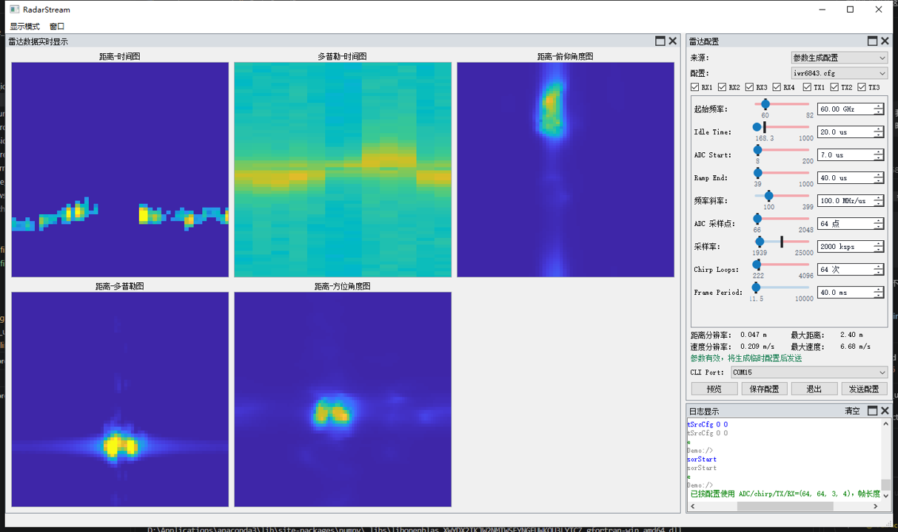
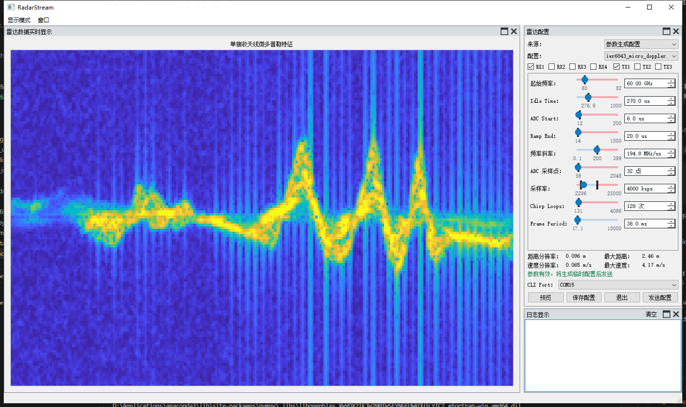

# RadarStream

**English** | [English (alternate copy)](README_zh-CN.md)

RadarStream is a real-time RAWDATA acquisition, processing, and visualization system for TI MIMO mmWave radar series.


https://github.com/user-attachments/assets/7ce99b51-a1af-4025-8a84-ee580eb92d04

Demo1: Real-time Motion Detection and Radar Feature Visualization

## Project Overview

This system supports Texas Instruments' MIMO mmWave radar series for real-time raw data acquisition, processing, and visualization. In addition to the RF evaluation board, the DCA1000EVM is required for data capture. Currently, the system has been tested with:
- IWR6843ISK
- IWR6843ISK-OBS
- IWR1843ISK

If you encounter any issues while using this project, please feel free to submit a pull request.

## Features ✨

*   **Real-time, Multi-threaded Radar Data Acquisition from TI MIMO mmWave Radar Sensors:**
    *   Leveraging a **multi-threaded architecture 🧵** for data acquisition and processing.
    *   To overcome Python's Global Interpreter Lock (GIL) and enable true multi-core processing, the data acquisition module is **wrapped in C 🚀**, ensuring near real-time, frame-loss-free data capture and handling.
*   **Multi-dimensional Feature Extraction:**
    *   Range-Time Information (RTI) 
    *   Doppler-Time Information (DTI) 
    *   Range-Doppler Information (RDI) 
    *   Range-Azimuth Information (RAI) 
    *   Range-Elevation Information (REI) 
*   **Interactive Visualization Interface**
*   **Radar Configuration Hot Reload:**
    *   Edit valid Profile/Frame parameters and click **Send Config** again;
        RadarStream applies the new configuration without restarting the
        application.
    *   The native capture buffer and DSP processor are rebuilt automatically
        for the new ADC/chirp/TX/RX dimensions, and the plots respond as soon
        as the radar resumes streaming.

## Interface Preview

### Full Multi-dimensional Feature Mode

The full-feature view displays RTI, DTI, RDI, RAI, and REI in a fixed 2 x 3
grid while the dockable configuration and log panels remain independently
movable.

<p align="center">
  
</p>

### Micro-Doppler Mode

The Micro-Doppler view provides a larger single-feature workspace alongside
the same real-time radar configuration controls.

<p align="center">
  
</p>

## Requirements

- Python 3.7+
- PyQt5
- PyQtGraph
- NumPy
- Matplotlib
- Serial

## Hardware Requirements

- TI MIMO mmWave Radar Sensor (tested with IWR6843ISK, IWR6843ISK-OBS,
  and IWR1843ISK)
- DCA1000 EVM (essential for raw data capture)
- PC with Windows OS 

## Firmware Requirements
The firmware must be selected from the `mmwave_industrial_toolbox_4_10_1\labs\Out_Of_Box_Demo\prebuilt_binaries/` directory inside any version of the mmwave_industrial_toolbox.  
There is no strict requirement to use version 4.10.1.

### High-frame-rate RAW ADC Capture Firmware

The repository also provides the streamlined
[`firmware/Studio_CLI_xWR68xx_obs.bin`](firmware/Studio_CLI_xWR68xx_obs.bin)
firmware image. It removes all on-chip signal-processing stages, including
range/Doppler detection, CFAR, angle estimation, and point-cloud generation.
The radar is therefore dedicated to RF configuration, raw ADC acquisition,
and LVDS streaming, reducing on-chip processing overhead and leaving more
timing margin for higher capture frame rates and shorter frame periods. Radar
features are processed by RadarStream on the host computer.

A complete cfg format example for this firmware is:

```text
flushCfg
dfeDataOutputMode 1
channelCfg 15 7 0
adcCfg 2 1
adcbufCfg -1 0 1 1 1
profileCfg 0 60 20 7 40 0 0 100 1 64 2000 0 0 30
chirpCfg 0 0 0 0 0 0 0 1
chirpCfg 1 1 0 0 0 0 0 2
chirpCfg 2 2 0 0 0 0 0 4
frameCfg 0 2 64 0 40 1 0
lowPower 0 0
lvdsStreamCfg -1 0 1 0
testSrcCfg 0 0
sensorStart
```

See
[`firmware/README_Studio_CLI_xWR68xx_obs.md`](firmware/README_Studio_CLI_xWR68xx_obs.md)
for its exact scope, usage notes, and companion configuration. Higher frame
rates remain subject to chirp timing, LVDS bandwidth, DCA1000 Ethernet
throughput, and host-processing limits.

## Setup and Installation

1. Clone this repository
2. Install the required dependencies:
   ```
   pip install pyqt5 pyqtgraph numpy matplotlib pyserial
   ```
3. Connect the mmWave radar sensor and DCA1000 EVM to your computer (only need a 5V 3A DC power wire,  a Ethernet Cable, and a micro USB wire)
4. Configure the network IPv4 settings (referencing the IPv4 configuration process from using mmWaveStudio for the DCA1000 EVM)

Two different acquisition methods are shown here: one figure displays Raspberry Pi 4B acquisition, while the other demonstrates Windows-based  acquisition. However, the Raspberry Pi acquisition has very few frames during real-time processing and display, making it prone to data loss. (not recommended to use Raspberry Pi for acquisition)

<p align="center">
  
  
  
  
</p>

## 3D Printed Mount

The repository includes STL files for a 3D printed structure designed to mount and secure the DCA1000EVM board.

**Note:** You will need some M3 size nylon standoffs and screws for assembly.

<p align="center">
  
</p>

## Usage

1. Run the main application:
   ```
   python main.py
   ```
2. Select the appropriate COM port for the radar CLI interface
3. Choose either **Preset config file** or **Generated config** in the radar
   configuration component
4. For a preset file, select an existing `.cfg`; for generated mode, adjust
   the IWR6843 Profile/Frame sliders and RX/TX channel checkboxes
5. Click **Send Config** to initialize the radar, or **Save Config** to keep the
   generated configuration
6. Use the interface to:
   - Visualize radar data in real-time
   - Capture training data for machine learning models

While the application is running, parameters can be edited and sent again
without restarting RadarStream. After a successful send, the active capture
and visualization pipeline immediately switches to the new radar profile.

The interface is composed of four independent dock panels: radar data,
radar configuration, capture, and log display. Each panel can be moved, floated,
docked again, closed, or restored from the **Window** menu. **Real-time
system** and **Micro-Doppler** are mutually exclusive choices in the
**Display mode** menu; they are no longer separate tabs. Dragging a dock title
shows four placement guides and a highlighted drop preview.

The application UI can be opened without connecting the radar or DCA1000.
Hardware and the native capture library are initialized only after clicking
"Send Config". If Windows reports error `10049`, configure the capture network
adapter IPv4 address to match `NetworkConfig.host_address` in `app_config.py`.

On startup, RadarStream automatically selects the TI XDS110 Application/User
UART or the Silicon Labs CP2105 Enhanced COM Port as the radar CLI port. The
Standard/Data port is not used because raw samples arrive through DCA1000.

## Configuration

Runtime and hardware policy is centralized in `app_config.py`. The selected TI
CLI `.cfg` file is the source of truth for ADC samples, chirps per TX, TX count
and RX count. Before each connection, RadarStream parses those values, rebuilds
the native double-buffer to the exact frame length and recreates the DSP
processor. Switching between compatible frame configurations no longer
requires editing `app_config.py`.

`DEFAULT_CONFIG.radar` is only the fallback before a file is selected. Network,
DSP and path policies still come from `AppConfig`; derived values such as raw
frame length and virtual antenna count are calculated automatically. A cfg for
a different physical antenna layout may still need a corresponding
`DspConfig` azimuth/elevation channel mapping, because array geometry cannot be
inferred safely from TI CLI commands alone.

The dockable radar configuration component supports two workflows. Existing
files under `radar_configs/` remain selectable and are sent without rewriting;
their `channelCfg`, `profileCfg` and `frameCfg` values are parsed back into the
controls and calculated performance indicators. Editing any control switches
the component to generated mode. In generated mode, RadarStream validates the
IWR6843 frequency range, ADC sampling window, channel masks and frame timing,
then injects the edited values into
`radar_configs/iwr6843_micro_doppler.cfg`. Sending uses an automatically cleaned
temporary `.cfg`; **Save Config** writes the same generated text to a permanent
file chosen by the user.

### Configuration Hot Reload

After editing valid parameters, click **Send Config** to hot-reload the radar
configuration. RadarStream stops the current hardware pipeline, parses the new
frame shape, rebuilds the native capture buffer and DSP processor, sends the
cleaned CLI commands, and then resumes real-time visualization. Neither the
application nor `app_config.py` needs to be restarted or edited.

> [!CAUTION]
> Host-side validation catches the known frequency, ADC-window, antenna-mask,
> and frame-timing constraints, but the radar firmware is still the final
> authority. An unsupported or invalid parameter combination may be rejected
> after `sensorStop` and can occasionally leave the radar CLI unable to recover
> through another send. In that case, press the evaluation board's physical
> **RESET/NRST** button, wait for the `mmwDemo:/>` prompt, and resend a known-good
> configuration.

Mutable UI/DSP coordination is kept separately in `runtime_state.py`. The old
string-keyed global state module has been removed from the application flow.

Core regression tests do not require radar hardware:

```
python -m unittest discover -s tests -v
```


## Project Structure

- `assets/`: static resources
  - `media/`: README images and demo media
  - `cad/`: 3D-printing STL and CAD source files
- `radar_configs/`: TI radar CLI configuration files
- `firmware/`: radar firmware binaries
- `native/`: native UDP capture binaries for supported platforms
- `radar_dsp/`: reusable low-level radar DSP algorithms
- `radar_configurator/`: reusable IWR6843 cfg engine and compact PyQt5 component
- `tests/`: hardware-independent regression tests
- `main.py`: application entry point and composition root
- `app_config.py`: centralized immutable application configuration
- `runtime_state.py`: thread-safe display and capture runtime state
- `data_pipeline.py`: native capture buffer and processing threads
- `signal_processor.py`: stateful RTI/DTI/RDI/RAI/REI feature extraction
- `hardware_interfaces.py`: radar EVM and DCA1000 communication adapters
- `radar_profile.py`: TI CLI profile shape validation
- `radar_tlv.py`: IWR6843 configuration and TLV parser
- `main_window_ui.py`: dock-based PyQt5 main-window layout
- `colormap_utils.py`: PyQtGraph colormap conversion helpers


## Citation

If this project helps your research, please consider citing our papers that are closely related to this tool:

```
@ARTICLE{11270504,
  author={Chen, Qin and Lu, Qunfeng and Chen, Yaoxi and Tian, Yu and Cui, Zongyong and Cao, Zongjie},
  journal={IEEE Transactions on Instrumentation and Measurement}, 
  title={Domain-Generalized Gesture Recognition via mmWave Radar Signal Multi-View Learning}, 
  year={2025},
  doi={10.1109/TIM.2025.3637962}}

@ARTICLE{10714388,
  author={Chen, Qin and Cui, Zongyong and Tian, Yu and Chen, Yaoxi and Cao, Zongjie},
  journal={IEEE Internet of Things Journal}, 
  title={Joint Position Estimation for Hand Motion Using MIMO FMCW mmWave Radar}, 
  year={2025},
  volume={12},
  number={3},
  pages={2838-2853},
  doi={10.1109/JIOT.2024.3478234}}

@ARTICLE{10288185,
  author={Chen, Qin and Cui, Zongyong and Zhou, Zheng and Tian, Yu and Cao, Zongjie},
  journal={IEEE Internet of Things Journal}, 
  title={MMHTSR: In-Air Handwriting Trajectory Sensing and Reconstruction Based on mmWave Radar}, 
  year={2024},
  volume={11},
  number={6},
  pages={10069-10083},
  doi={10.1109/JIOT.2023.3325258}}

```


## Acknowledgements

We gratefully acknowledge OpenAI Codex, without whose assistance this project's extensive refactoring would have been difficult to complete.

This project references and builds upon:
- [real-time-radar](https://github.com/AndyYu0010/real-time-radar) by AndyYu0010
- [OpenRadar](https://github.com/PreSenseRadar/OpenRadar) - specifically the DSP module

## TODO

Completed milestones:

- [x] Validate compatibility with multiple RF evaluation boards (IWR6843ISK,
  IWR6843ISK-OBS, and IWR1843ISK)
- [x] Make the native capture API flexible enough to rebuild capture buffers
  automatically from the selected radar profile

Future improvements planned for this project:

- [ ] Add offline RAW ADC recording playback for repeatable DSP analysis
- [ ] Add real-time capture health monitoring for packet loss, buffer backlog,
  and processing latency
- [ ] Persist and restore dock layouts, selected configurations, and display
  preferences
- [ ] Add automated hardware-in-the-loop regression tests for supported radar
  boards and configuration profiles
